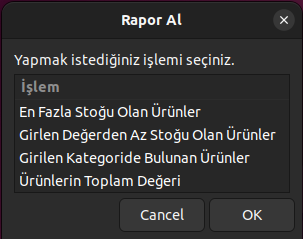
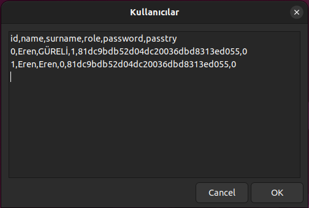

# linux-zenity-odev
### [Videonun Linki](https://youtu.be/RCDL3Twc0Qc)
### [GitHub Linki](https://github.com/erengureli/linux-zenity-odev)

Bu proje zenity kütüphanesi kullanılarak linux bash içinde yazılmış envanter sistemidir. Projenin amacı linux bash ve zenity'yi daha detaylı öğrenebilmektir. Şimdi bütün menüleri teker teker gösterip açıklayacağım.

# 1. Giriş Ekranı

Giriş yapmak için ID ve şifrenin istendiği arayüz. Eğer hatalı şifre girilirse uyarı verip logladıktan sonra `passtry` değişkenini 1 arttırmaktadır. Eğer bu değer 3 olursa hesap kitlenir ve bir yönetici olmadan açılamaz.

# 2. Ana Menü

Kullanıcı ve Yönetici için ayrı ana menü tasarlanmıştır. Bu tasarımdan dolayı kullanıcılar yönetici yetkili sayfalara girememektedir. Eğer kullanıcılar bir şekilde admin paneline erişirse ve bir işlem gerçekleştirirse karşılarına hata mesajı çıkmaktadır.

## 2.1. Ürün Ekle

Eklemek istenilen ürünün bilgileri kontrol edildikten sonra OK'a basılınca direkt kullanici.csv dosyasının içine kaydediyor.

## 2.2. Ürün Listele

`depo.csv` dosyasını yazdırmaktadır.

## 2.3. Ürün Güncelle

Girilen ID'deki ürünün bilgilerini, girilen bilgilerden boş olmayanları kontrol ederek `depo.csv` dosyasını değiştirir.

## 2.4. Ürün Sil

Girilen ID'deki ürün varsa ürün bilgilerini boş yapıyor bu sayede silinmiş oluyor. ID silinmediğinden ve başka ürüne geçmediğinden loglardan takip edilebiliyor.

## 2.5. Rapor Al

### 2.5.1. En Fazla Stoğu Olan Ürünler

### 2.5.2. Girilen Değerden Az Stoğu Olan Ürünler

### 2.5.3. Girilen Kategoride Bulunan Ürünler

### 2.5.4. Ürünlerin Toplam Değeri

## 2.6. Kullanıcı Yönetimi

### 2.6.1. Kullanıcı Ekle

Girilen şifreyi md5 ile şifreleyip en son kullanıcının ID'sinden 1 fazla ID atayıp yeni kullanıcı oluşturur. Hiç kullanıcı yoksa 0 atar.

### 2.6.2. Kullanıcı Listele

`kullanici.csv` dosyasını yazdırmaktadır.

### 2.6.3 Kullanıcı Güncelle

Girilen ID'deki kullanıcı bilgilerini, girilen bilgilerden boş olmayanları kontrol ederek `kullanici.csv` dosyasını değiştirir.

### 2.6.4. Kullanıcı Sil

Girilen ID'deki kullanıcı varsa kullanıcının bilgilerini boş yapıyor bu sayede silinmiş oluyor. ID silinmediğinden ve başka kullanıcıya geçmediğinden loglardan takip edilebiliyor.

## 2.7. Program Yönetimi

## 2.7.1. Diskte Kapladığı Alan

## 2.7.2. Diske Yedek Al

Çıkan menüden bir klasör seçilir. Seçilen klasöre bütün .csv dosyaları kopyalanmaktadır.

## 2.7.3. Hata Kayıtlarını Göster

## 2.8. Çıkış Yap

`Çıkış Yap`, `Cancel` ya da sağ üstteki X tuşuna basınca programdan çıkmaktadır.
